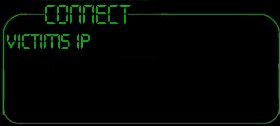

## An AWESOME chat program NEO \(normal version\)  with over 30 functions\. This is a MUST SEE\!\!\!\!\!\!\!\!\!\!

### Description

This is an AWESOME chat program (controls remote computer too, technically a trojen but I haven't supplied its server) that has over 30 functions and counting. It isnt quite finished yet but has many features from fun to more advanced ones like email sender,spellchecker, complete custom message box maker to scare the other side and an execute files remotely. All this and more. The source is commented on very well and it is easy to learn how to make your own program just like this. I have made it easy to use, the source is very readable and those of you who want to make one of these ( i can see the attraction as they are so cool) can learn. PLEASE VOTE for this one guys!!!!!!!!. It is my biggest submission to PSC ever and has taken hard work. You can contact me (details in code) if you so wish. Thank you

PS:You ned the agents installed for this version. If this is going to be hard for you then dld my other version that doesn't use them, cos I'm sooo nice!! ENJOY!!
 
### More Info
 

             |
---                |---
**Submitted On**   |2000-10-27 17:50:26
**By**             |[Brutus](https://github.com/Planet-Source-Code/PSCIndex/blob/master/ByAuthor/brutus.md)
**Level**          |Intermediate
**User Rating**    |3.8 (19 globes from 5 users)
**Compatibility**  |VB 6\.0
**Category**       |[Internet/ HTML](https://github.com/Planet-Source-Code/PSCIndex/blob/master/ByCategory/internet-html__1-34.md)
**World**          |[Visual Basic](https://github.com/Planet-Source-Code/PSCIndex/blob/master/ByWorld/visual-basic.md)
**Archive File**   |[CODE\_UPLOAD111901112000\.zip](https://github.com/Planet-Source-Code/brutus-an-awesome-chat-program-neo-normal-version-with-over-30-functions-this-is-a-must-se__1-12456/archive/master.zip)

